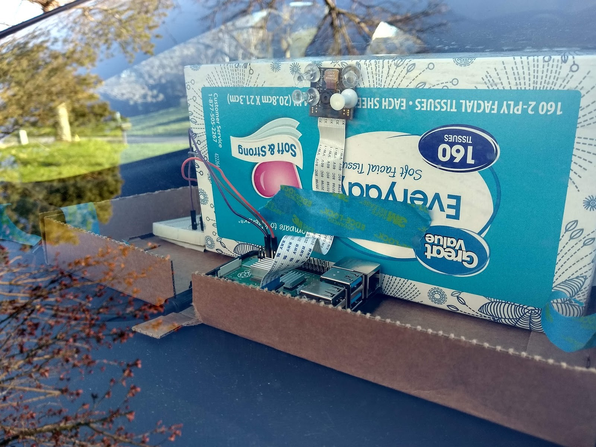

# rpi_road_object_detection
Repository to run object detection on the Raspberry Pi 4! :D This configuration uses an SSD-Mobile Net model trained on an autonomous driving dataset.
I followed this tutorial to get everything setup: https://github.com/EdjeElectronics/TensorFlow-Lite-Object-Detection-on-Android-and-Raspberry-Pi/blob/master/Raspberry_Pi_Guide.md

Results
=======


Configuration
=============


Core
* Raspberry Pi 4 GB
* Raspberry Pi 5MP Camera (rev 1.3)

Other
* LED and Resistor
* Small breadboard 
* GPIO push button
* 3.5 Amp USB-C Power Supply

This tissue box setup isn't the greatest, but it's what I used to mount the PI on the dashboard of my car. I then used the USB-C cable plugged into the AC outlet of my car while I drove around to record and process footage.

Setting Up Software
====================
1.) Open a command prompt

2.) Make sure pi is up to date:
```
sudo apt-get update 
sudo apt-get upgrade
```

3.)Clone Repository:
```
git clone https://github.com/ecd1012/rpi_road_object_detection.git
```
4.) Change directory to source code:
```
cd rpi_road_object_detection
```
5.) Install Virtual Environment: 
```
sudo pip3 install virtualenv
```
6.) Make virtual environment:
```
python3 -m venv TFLite-venv
```
7.) Activate Environment:
```
source TFLite-venv/bin/activate
```
8.) Install the dependencies:
```
sudo apt-get -y install libjpeg-dev libtiff5-dev libjasper-dev libpng12-dev
sudo apt-get -y install libavcodec-dev libavformat-dev libswscale-dev libv4l-dev
sudo apt-get -y install libxvidcore-dev libx264-dev
sudo apt-get -y install qt4-dev-tools libatlas-base-dev
pip3 install opencv-python==3.4.6.27
pip3 install tensorflow
```
9.) Make sure camera module is enabled:
```
sudo raspi-config
```
10.) Go to interfacing options and make sure the Pi Camera is enabled

Setting Up Hardware
===================
11.) Connect a push button to GPIO pin 17. This will be used as input. Make sure you use a resistor with the LED!

Help: https://www.youtube.com/watch?v=BWYy3qZ315U&ab_channel=O%27Reilly

12.)Connect an LED to GPIO PIN 4. This LED will turn on to indicate when the program is running.

Help: https://www.youtube.com/watch?v=3TDJ4FmtGgk&ab_channel=O%27Reilly

14.) Connect Pi Camera Module to Raspberry Pi.
Help: https://www.youtube.com/watch?v=0hrF8Wq8SSQ&ab_channel=BINARYUPDATES


Running Detection
=================
15.)After all your hardware and software is configured correctly run the following command:
```
python TFLite_detection_webcam_loop.py --modeldir=TFLite_model_bbd --output_path processed_images
```
Where the --output_path you specify is where you want images saved.

16.) The script will start running and wait for you to press the GPIO input button to start processing the video feed from the camera. 
Once you press the button, the green LED will turn on and the pi will start feeding and processing the video stream through the neural network.
Processed images will be saved to the '--output_path' you specified over the command line.

17.) If you like, make a video out of the images.
You can do this with gif making software, video making software, or ffmpeg.
Help: https://stackoverflow.com/questions/24961127/how-to-create-a-video-from-images-with-ffmpeg


18.) Enjoy!! :)


